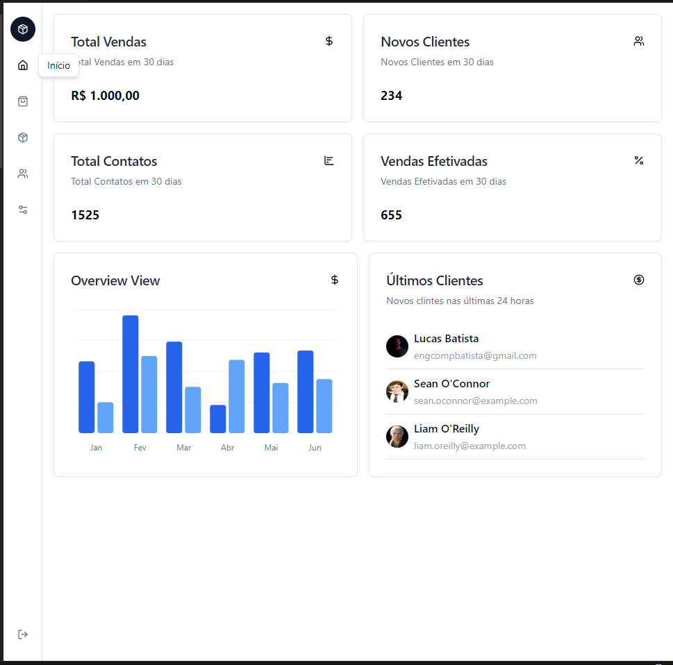

Link:
[dashboard-git-main-lucasbats-projects.vercel.app](dashboard-git-main-lucasbats-projects.vercel.app
)
<div>
&nbsp &nbsp &nbsp
 &nbsp &nbsp &nbsp
 
</div>

## Getting Started

First, run the development server:

```bash
npm install

npm run dev
# or
yarn dev
# or
pnpm dev
# or
bun dev
```

Open [http://localhost:3000](http://localhost:3000) with your browser to see the result.


